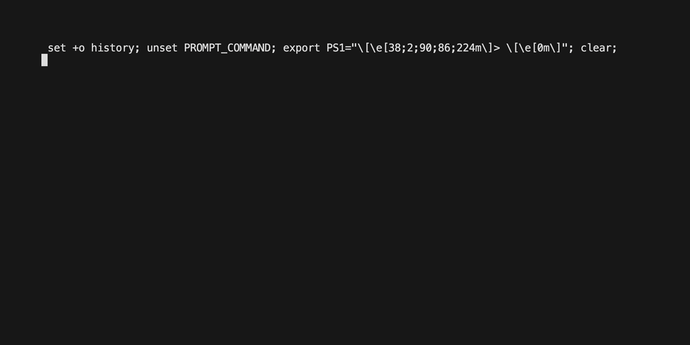

# fun-run

[](https://github.com/a-poor/fun-run/actions/workflows/go.yml)
[](https://github.com/a-poor/fun-run/actions/workflows/goreleaser.yml)

_created by Austin Poor_

A simple CLI for executing multiple processes simultaneously.


<p align="center">
    
</p>


## Installation

`fun-run` can be installed with go...

```sh
go install github.com/a-poor/fun-run@latest
```

Or pre-built binaries can be downloaded from the [releases](https://github.com/a-poor/fun-run/releases).


## Usage

<details>
<summary>CLI help:

```sh
fun-run --help
```
</summary>

```
Fun Run is a tool for running multiple processes simultaneously.

It is designed to be used in development environments where you want
to run multiple processes (e.g. a web server and a database server)
simultaneously. It is similar to the 'docker-compose' tool, but for
running shell commands rather than containers.

Usage:
  fun-run [command]

Available Commands:
  completion  Generate the autocompletion script for the specified shell
  help        Help about any command
  init        Initialize a new fun-run config file.
  run         Start running your commands.
  validate    Validate the configuration file

Flags:
  -h, --help      help for fun-run
  -V, --verbose   Help message for toggle
  -v, --version   version for fun-run

Use "fun-run [command] --help" for more information about a command.
```
</details>


